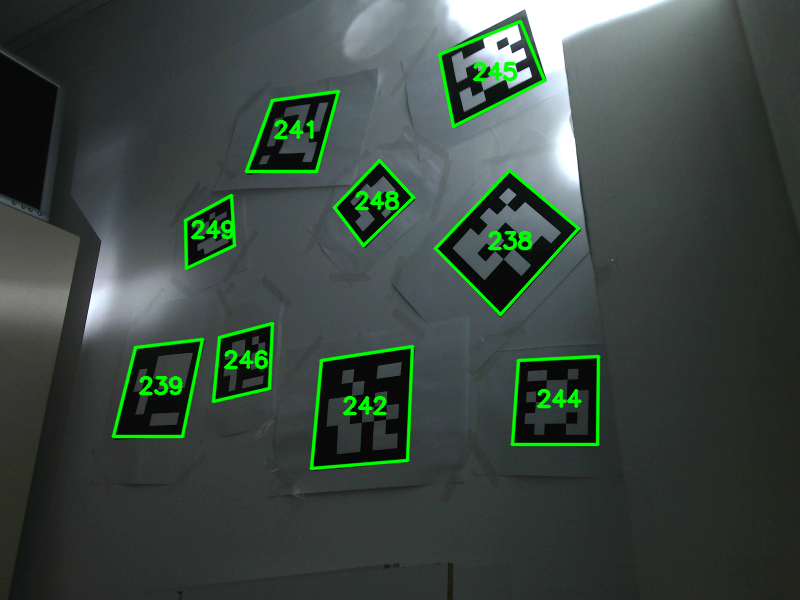

# DeepArUco++: improved detection of square fiducial markers in challenging lighting conditions
Support code for the DeepArUco++ method. Work by Rafael Berral-Soler, Rafael Muñoz-Salinas, Rafael Medina-Carnicer and Manuel J. Marín-Jiménez.

* **NEW (08/11/2024)**: Fixed Colab demo.
* **NEW (08/11/2024)**: Flying-ArUco v2 dataset available at [](https://doi.org/10.5281/zenodo.14053985). Dataset generation code added to this repository.
* **NEW (07/03/2024)**: Shadow-ArUco dataset available at [](https://doi.org/10.5281/zenodo.10791293)
* **NEW (06/11/2023)**: Try our method in this Google Colab notebook. Updated to DeepArUco++! [](https://colab.research.google.com/drive/1kR9BYXs9g6N45F-cDiMZ48aR_uxzdEcl?usp=sharing)

To detect markers locally use the demo.py script:

```
python demo.py <path to image> <output path>
```

## Pretrained models
Demo code, pretrained models and dataset generation code are already available!
Some example predictions:

<p align = "center">
  
</p>

## Flying-ArUco v2 dataset
Dataset available at [](https://doi.org/10.5281/zenodo.14053985)  
Some samples from the dataset:

<p align = "center">
  
</p>

To build the dataset by yourself, you can use the ``build_dataset`` script. Please note that variations may occur due to the use of random operations. In order to better match our results, you can use the pre-generated datasets we provide through Zenodo.

```
python build_dataset.py <source MSCOCO train2017 path> <target flyingarucov2 path> [options]
```

The script allows passing options to achieve multiple effects, such as merging markers with the background luma or using variable width for the marker borders. Please refer to the script documentation to learn more (passing the ``--help`` option to the script):

```
python build_dataset.py --help
```

This dataset must be processed in order to train the marker detector model. To do so, use the ``build_detection`` script in the ``tools`` subdirectory

```
python build_detection.py <source flyingarucov2 path> <detection dataset path>
```

Further data augmentation can be done using the ``augment_dataset`` script, also found in the ``tools`` subdirectory:

```
python augment_dataset.py <detection dataset path> [options]
```

This script also allows for passing options to configure the data augmentation process, namely adding blur, gaussian noise and/or shifting colors. Please note that the augmentation process is done in-place, with the new samples being placed in the same source directory.

Finally, the regression dataset (used to train both the corner refinement and the marker decoding models) is built from the (augmented) detection dataset using the ``build_regression`` script (also in the ``tools`` subdirectory):

```
python build_regression.py <augmented dataset path> <annotations dir> <regression dataset path>
```

(``annotations dir`` should be the same as the un-processed FlyingArUco v2 directory, the one used as output for the ``build_dataset`` script).

## Shadow-ArUco dataset
Dataset available at [](https://doi.org/10.5281/zenodo.10791293)  
Some samples from the dataset:

<p align = "center">
  
</p>

## Citation
If you find our work helpful for your research, please cite our publication:
```  
@article{berral2024imavis,
  title = {DeepArUco++: Improved detection of square fiducial markers in challenging lighting conditions},
  journal = {Image and Vision Computing},
  pages = {105313},
  year = {2024},
  issn = {0262-8856},
  doi = {https://doi.org/10.1016/j.imavis.2024.105313},
  url = {https://www.sciencedirect.com/science/article/pii/S0262885624004189},
  author = {Rafael Berral-Soler and Rafael Muñoz-Salinas and Rafael Medina-Carnicer and Manuel J. Marín-Jiménez},
  keywords = {Fiducial markers, Deep neural networks, Marker detection, CNNs}
}
```

Additionally, you can cite our conference paper:

```
@InProceedings{berral2023ibpria,
  author = "Berral-Soler, Rafael
  and Mu{\~{n}}oz-Salinas, Rafael
  and Medina-Carnicer, Rafael
  and Mar{\'i}n-Jim{\'e}nez, Manuel J.",
  editor="Pertusa, Antonio
  and Gallego, Antonio Javier
  and S{\'a}nchez, Joan Andreu
  and Domingues, In{\^e}s",
  title = "DeepArUco: Marker Detection and Classification in Challenging Lighting Conditions",
  booktitle = "Iberian Conference on Pattern Recognition and Image Analysis",
  doi = {10.1007/978-3-031-36616-1_16},
  year = "2023",
  publisher = "Springer Nature Switzerland",
  pages = "199--210",
  isbn = "978-3-031-36616-1"
}
```
