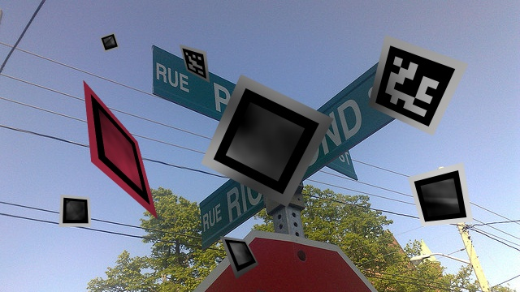

# DeepArUco: Marker detection and classification in challenging lightning conditions
Support code for the DeepArUco model. Work by Rafael Berral-Soler, Rafael Muñoz-Salinas, Rafael Medina-Carnicer and Manuel J. Marín-Jiménez.

**NEW (25/06/2023)**: Try our method in this Google Colab notebook. [Link](https://colab.research.google.com/drive/1VIPxzGAfZgb5z9JContHXwoUytPk1NW7?usp=sharing)

## Pretrained models
Demo code along with pretrained models will be available soon. 
Some example predictions:

  

## Flying ArUco dataset
This dataset will be available soon. 
Some samples from the dataset:

  

## Shadow ArUco dataset
This dataset will be available soon. 
Some samples from the dataset:

  
