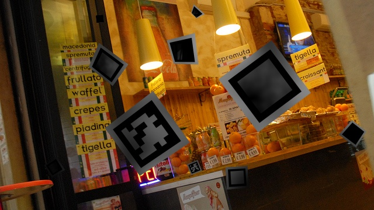
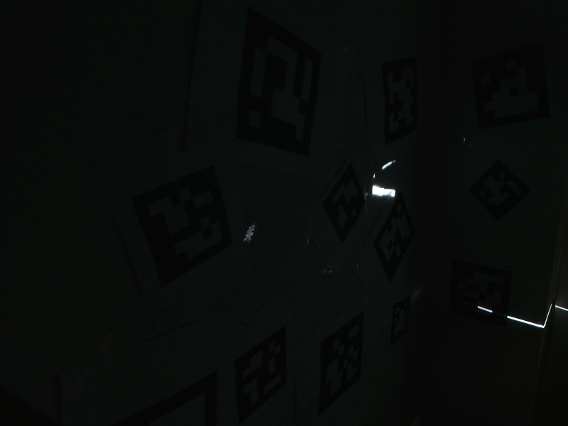

# DeepArUco++: improved detection of square fiducial markers in challenging lighting conditions
Support code for the DeepArUco++ method. Work by Rafael Berral-Soler, Rafael Muñoz-Salinas, Rafael Medina-Carnicer and Manuel J. Marín-Jiménez.

**NEW (06/11/2023)**: Try our method in this Google Colab notebook. Updated to DeepArUco++! [](https://colab.research.google.com/drive/1kR9BYXs9g6N45F-cDiMZ48aR_uxzdEcl?usp=sharing)

To detect markers locally use the demo.py script:

```
python demo.py <path to image> <output path>
```

## Pretrained models
Demo code along with pretrained models will be available soon. 
Some example predictions:

  

## Flying ArUco dataset
This dataset will be available soon. 
Some samples from the dataset:

  

## Shadow ArUco dataset
This dataset will be available soon. 
Some samples from the dataset:

  

## Citation
If you find our work helpful for your research, please cite our publications:
```
@InProceedings{10.1007/978-3-031-36616-1_16,
  author="Berral-Soler, Rafael
  and Mu{\~{n}}oz-Salinas, Rafael
  and Medina-Carnicer, Rafael
  and Mar{\'i}n-Jim{\'e}nez, Manuel J.",
  editor="Pertusa, Antonio
  and Gallego, Antonio Javier
  and S{\'a}nchez, Joan Andreu
  and Domingues, In{\^e}s",
  title="DeepArUco: Marker Detection and Classification in Challenging Lighting Conditions",
  booktitle="Pattern Recognition and Image Analysis",
  year="2023",
  publisher="Springer Nature Switzerland",
  address="Cham",
  pages="199--210",
  abstract="Detection of fiducial markers in challenging lighting conditions can be useful in fields such as industry, medicine, or any other setting in which lighting cannot be controlled (e.g., outdoor environments or indoors with poor lighting). However, explicitly dealing with such conditions has not been done before. Hence, we propose DeepArUco, a deep learning-based framework that aims to detect ArUco markers in lighting conditions where the classical ArUco implementation fails. The system is built around Convolutional Neural Networks, performing the job of detecting and decoding ArUco markers. A method to generate synthetic data to train the networks is also proposed. Furthermore, a real-life dataset of ArUco markers in challenging lighting conditions is introduced and used to evaluate our system, which will be made publicly available alongside the implementation.",
  isbn="978-3-031-36616-1"
}
```
