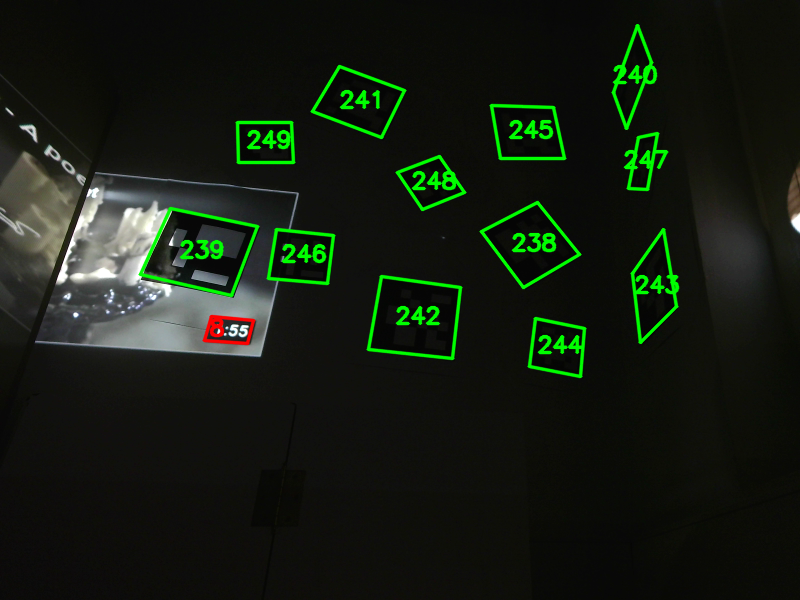

# DeepArUco: Marker detection and classification in challenging lightning conditions
Support code for the DeepArUco model. Work by Rafael Berral-Soler, Rafael Muñoz-Salinas, Rafael Medina-Carnicer and Manuel J. Marín-Jiménez.

## Pretrained models
Demo code along with pretrained models will be available soon. 
Some example predictions:

## Flying ArUco dataset
This dataset will be available soon. 
Some samples from the dataset:

## Shadow ArUco dataset
This dataset will be available soon. 
Some samples from the dataset:
